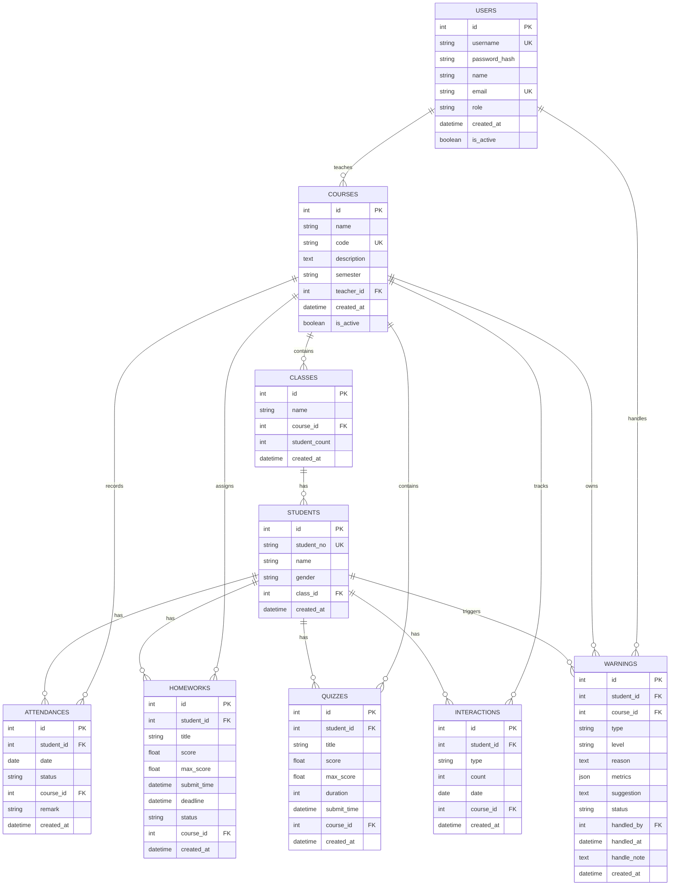

# 教学效果监督系统 E-R 图（Mermaid 版）

下面这段可以直接复制到支持 Mermaid 的编辑器里渲染。

## 论文里建议怎么放

图名建议直接写：`图4.5 数据库 E-R 图`

图下注释可以用这句：

`图4.5 展示了教学效果监督系统的核心实体及关系，其中课程、班级、学生构成基础教学组织结构，考勤、作业、测验、互动和预警记录围绕学生与课程展开。`

## 如果 Mermaid 渲染不出来

你可以直接照这个结构在 ProcessOn 或 draw.io 里手动画：

1. 最上方放 `USERS`
2. 第二层放 `COURSES`
3. 第三层放 `CLASSES`
4. 第四层放 `STUDENTS`
5. `STUDENTS` 右侧竖着排 `ATTENDANCES / HOMEWORKS / QUIZZES / INTERACTIONS / WARNINGS`
6. 再从 `COURSES` 分别连到这 5 张业务表
7. 从 `USERS` 再连一条到 `WARNINGS.handled_by`

这样布局最清楚，也最适合论文截图。
